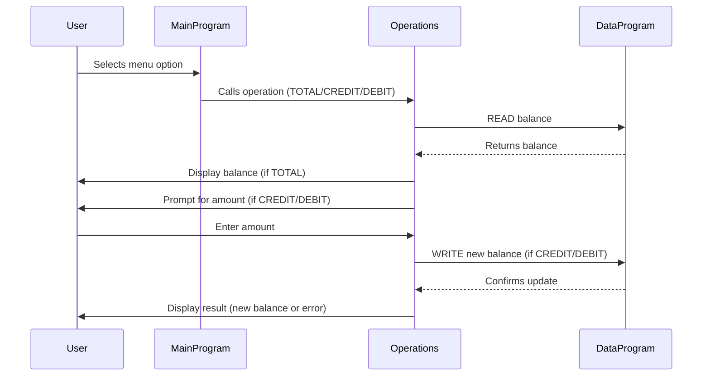

# COBOL Student Account System Documentation

This project contains legacy COBOL code for managing student accounts. Below is an overview of each COBOL file, their key functions, and business rules related to student accounts.

## Purpose of Each COBOL File

### `main.cob`
**Purpose:**
- Acts as the main entry point for the Account Management System.
- Presents a menu to the user for viewing balance, crediting, debiting, or exiting.
- Handles user input and delegates operations to the `Operations` program.

**Key Functions:**
- Menu display and user interaction.
- Calls `Operations` for each account action.

**Business Rules:**
- Only allows valid choices (1-4).
- Exits cleanly when the user selects "Exit".

---

### `operations.cob`
**Purpose:**
- Implements the logic for account operations: viewing balance, crediting, and debiting.
- Interacts with the `DataProgram` to read and update balances.

**Key Functions:**
- Handles three operations: `TOTAL` (view balance), `CREDIT` (add funds), and `DEBIT` (subtract funds).
- Validates sufficient funds before debiting.
- Updates balance after credit or debit.

**Business Rules:**
- Credit: Prompts for amount, adds to balance, and saves.
- Debit: Prompts for amount, checks for sufficient funds, subtracts if possible, and saves. Displays error if funds are insufficient.
- View Balance: Displays current balance.

---

### `data.cob`
**Purpose:**
- Manages persistent storage of the account balance.
- Provides read and write operations for the balance.

**Key Functions:**
- `READ`: Returns the current stored balance.
- `WRITE`: Updates the stored balance.

**Business Rules:**
- Ensures the balance is accurately read and written for all operations.

---

## Student Account Business Rules
- Initial balance is set to 1000.00.
- Only positive amounts can be credited or debited.
- Debit operations are blocked if the requested amount exceeds the current balance.
- All changes to the balance are persisted via the `DataProgram`.

---

For further details, refer to the source code in `/src/cobol/`.

---

## Sequence Diagram: Data Flow

